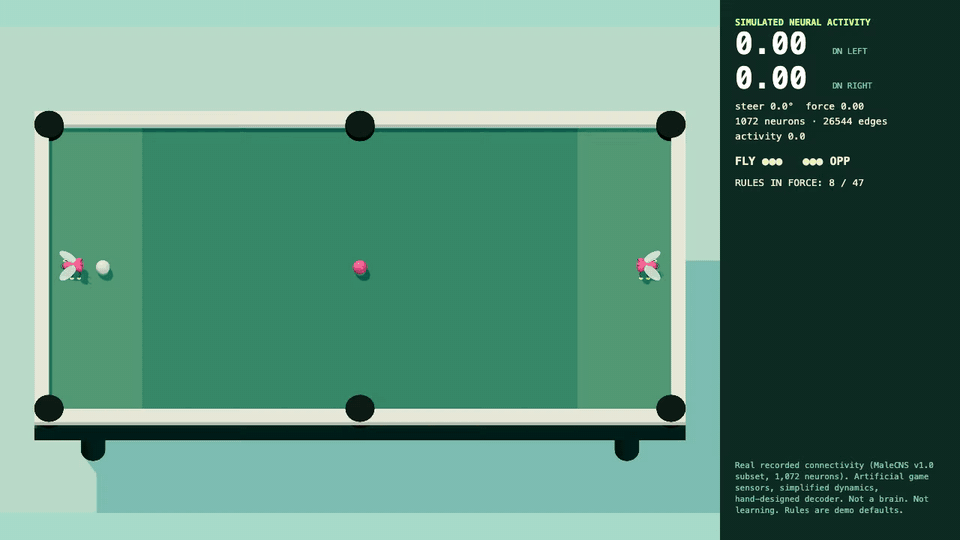

# CRUD Fly



A fruit fly plays crud, the no-cue pool game. The throw is driven by 1,072 real neurons from the male fruit-fly connectome.*

## What is real

- **The wiring.** 1,072 neurons and 26,544 directed synaptic connections from the MaleCNS v1.0 connectome (Berg et al., Cell 2026; FlyEM at HHMI Janelia, University of Cambridge, MRC LMB, Google Research; CC BY 4.0). The subset covers LC4 and LPLC2 looming-detector neurons, DNp01–06 and DNg02 descending neurons, the central and VNC neurons that bridge them, and wing and haltere motor neurons. Prepared by [AbijahKaj](https://github.com/AbijahKaj/fruit-fly-brain-research), pinned via [flyway-surfer](https://github.com/shivareddy42/flyway-surfer). See `src/brain/provenance.json`.
- **The physics.** A deterministic 120 Hz two-ball simulation with rolling friction, cushions, and six pockets. Every match is a replayable tape with state hashes; `public/replays/hero.json` reproduces the clip exactly.
- **The rules.** Two balls, no cues, three lives, shoot only from the short ends, the object ball must never stop, a pocket costs the last shooter a life, three serve faults cost a life. These are the public common core, labelled demo defaults. The full set of house caveats is not public and the `/ 47` is a joke.
- **The fly's body.** The controller cannot touch a ball. It must walk to a legal stance, line up, and complete a strike; the engine applies the impulse on contact.

## What is not

*Real recorded connectivity; artificial game sensors, simplified neuron dynamics, and a hand-designed action decoder. Not a complete brain, not recorded live neural activity, not evidence of learning.

Concretely: the object ball's bearing and closing speed are encoded as looming stimulus on the LC4/LPLC2 neurons by side. A signed, incoming-normalised rate model (from flyway-surfer's `pilot.js`, MIT) propagates activity through the graph. The mean activity of the left and right descending neurons is read out as an asymmetry index, centred on the graph's resting bias, and bends the fly's intercept aim by up to ±0.15 rad and nudges its force. Stance, timing, and the intercept itself come from a plain heuristic. The numbers on the panel are dimensionless model activity, not spikes. The fly wins about a quarter of its matches against the heuristic opponent.

## Run it

```sh
npm install
npm run dev
```

- `/?brain=1&seed=3` connectome fly vs heuristic (default).
- `/?brain=0` heuristic vs heuristic.
- `/?view=2d` top-down debug view.
- `/?record=1&seconds=16` records a 1280×720 WebM of the composited scene and HUD to `tools/out/` via the dev server, plus the replay tape.

`npm test` runs 33 tests: physics, the rules turn machine, replay determinism, and the pilot (including a mirrored-observation test that the throw angle flips sign with the object ball's side).

## Credits

- Connectome data: Berg et al., FlyEM / HHMI Janelia, University of Cambridge, MRC LMB, Google Research. CC BY 4.0. https://male-cns.janelia.org/download/
- `flight-v1` subset: AbijahKaj, MIT.
- Circuit pilot pattern, fly geometry, animation, palette: Shiva Reddy, flyway-surfer, MIT (`src/brain/LICENSE-flyway-surfer.txt`).
- The meme format: Matty Hempstead's flytok and the wave of fly-brain game demos that followed the MaleCNS release.
