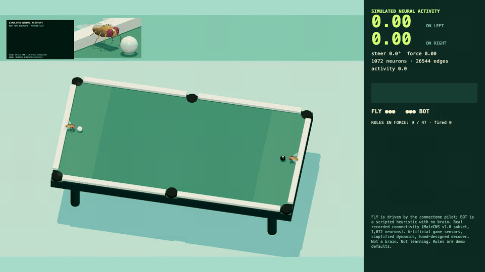

# CRUD Fly



**Live:** https://rupertdodkins.github.io/crud-fly/?brain=1&seed=42 · [MP4](public/media/crud-fly-seed42.mp4)

A fruit fly plays crud, the no-cue pool game. 1,072 real neurons from the male fruit-fly connectome nudge its aim.* It loses to a scripted bot with no brain about three times in four.

## What is real

- **The wiring.** 1,072 neurons and 26,544 directed synaptic connections from the MaleCNS v1.0 connectome (Berg et al., Cell 2026; FlyEM at HHMI Janelia, University of Cambridge, MRC LMB, Google Research; CC BY 4.0). The subset covers LC4 and LPLC2 looming-detector neurons, DNp01–06 and DNg02 descending neurons, the central and VNC neurons that bridge them, and wing and haltere motor neurons. Prepared by [AbijahKaj](https://github.com/AbijahKaj/fruit-fly-brain-research), pinned via [flyway-surfer](https://github.com/shivareddy42/flyway-surfer). See `src/brain/provenance.json`.
- **The physics.** A deterministic 120 Hz two-ball simulation with rolling friction, cushions, and six pockets. Every match is a replayable tape with state hashes; `public/replays/hero.json` reproduces the clip exactly.
- **The rules.** Two balls, no cues, three lives each. Ball in hand: the shooter picks the cue ball up wherever it stopped and may throw it only from a short end, either end, never the long sides. Contact passes the turn. The object ball must travel six inches after a hit (less and the hitter pays) and must never stop on your turn (the dead ball is on the player in hand). A pocket costs the last non-shooter a life. The loser serves at a stationary object ball on the foot spot, three attempts. Checked against the ACPA and Official Crud League rules; labelled demo defaults because house rules vary and the `/ 47` is a joke.
- **The fly's body.** The controller never teleports a ball. It has to walk to the cue ball (reach 10 cm), carry it to a short end at walking speed, turn, and release; the throw leaves from the grasp point. Both flies run the length of the table following the cue ball, the way humans do.

## What is not

*Real recorded connectivity; artificial game sensors, simplified neuron dynamics, and a hand-designed action decoder. Not a complete brain, not recorded live neural activity, not evidence of learning.

Concretely: the object ball's bearing and closing speed are encoded as looming stimulus on the LC4/LPLC2 neurons by side. A signed, incoming-normalised rate model (from flyway-surfer's `pilot.js`, MIT) propagates activity through the graph. The mean activity of the left and right descending neurons is read out as an asymmetry index, centred on the graph's resting bias, and bends the fly's intercept aim by up to ±0.025 rad (about 1.4°, a ball width at serve distance) and nudges its force. Stance, timing, and the intercept itself come from a plain heuristic. The numbers on the panel are dimensionless model activity, not spikes. The fly (FLY) wins about 28% of its matches against the scripted opponent (BOT) over 40 seeds; a larger gain lets the graph's asymmetry exceed a ball width and it fails the three-attempt serve instead of playing.

## Run it

```sh
npm install
npm run dev
```

- `/?brain=1&seed=42` connectome fly vs scripted bot (default). `FLY` is the connectome pilot, `BOT` has no brain.
- `/?brain=0` heuristic vs heuristic.
- `/?view=2d` top-down debug view.
- `/?record=1&seconds=16` records a 1280×720 WebM of the composited scene and HUD to `tools/out/` via the dev server, plus the replay tape.

`npm test` runs 55 tests: physics, the rules turn machine (either-end legality, six-inch rule, serve faults, pocket penalties, a scripted grab-and-carry integration), replay determinism, the pilot (including a mirrored-observation test that the throw angle flips sign with the object ball's side), and the vendored soma positions.

## Deploy

Static site, no backend. `.github/workflows/pages.yml` runs the tests, builds with `BASE_PATH=/crud-fly/`, and publishes `dist/` to GitHub Pages on every push to `main`. The only server-side code in the repo is a dev-only Vite middleware that lets the in-browser recorder save WebM files to `tools/out/`; it is not part of the build.

## How it was built

One evening, one integration owner, three agents on disjoint ownership fences. A type sketch of the domain (`MatchState`, the `Turn` state machine, `Frame`) was committed before any fan-out, and every later contract change was additive so released files kept compiling. The core is a deterministic 120 Hz simulation whose matches serialise to tapes with state hashes, so the visual layer could be iterated by a separate agent against frozen replays without touching physics, rules, or the controller. The connectome pilot wraps the same heuristic the opponent uses, with the graph allowed to perturb only the throw; when I let it perturb more, the fly lost 40 of 40 seeds and could not serve, so the gain was set where the brain's influence fits inside a ball width and the result is reported above rather than tuned away. Every borrowed asset carries a provenance file with source, commit or checksum, and licence. CI runs the tests and deploys the static build to GitHub Pages on push.

Not done, deliberately: no training. The honest next step would be a small linear readout from the descending-neuron rates to an aim correction, fitted against the heuristic over seeds with the connectome weights frozen, and scored the same way the current gain was.

## Credits

- Connectome data and soma positions: Berg et al., FlyEM / HHMI Janelia, University of Cambridge, MRC LMB, Google Research. CC BY 4.0. https://male-cns.janelia.org/download/ The brain panel draws 40,000 real somata as a static backdrop and lights only the 1,072 simulated units at their real coordinates (`src/brain/positions-provenance.json`).
- `flight-v1` subset: AbijahKaj, MIT.
- Circuit pilot pattern, fly geometry, animation, palette: Shiva Reddy, flyway-surfer, MIT (`src/brain/LICENSE-flyway-surfer.txt`).
- Fly anatomy: FlyBody, Google DeepMind / HHMI Janelia, via mujoco_menagerie. Apache-2.0 (`src/presentation/assets/`). Geometry only; the gait is ours.
- The meme format: Matty Hempstead's flytok and the wave of fly-brain game demos that followed the MaleCNS release.
